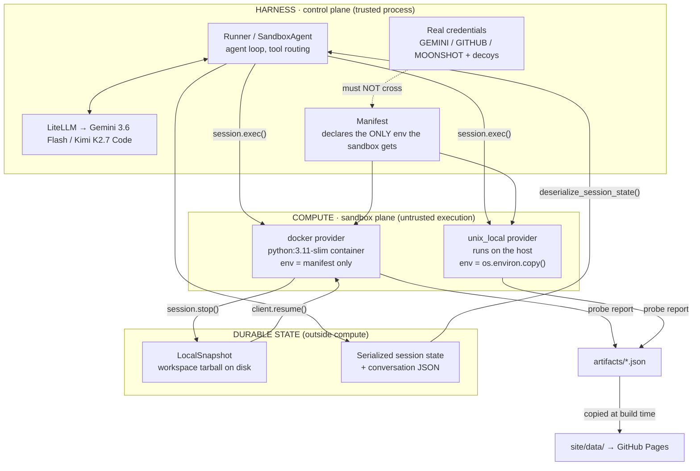

# Architecture — openai-agents-sdk-v2-durable-sandbox

## Overview

This repo is an experiment rig plus a static site that presents its results. Nothing here is a
service. Two Python experiments drive the OpenAI Agents SDK v2 sandbox stack against real Docker
containers, write their findings to JSON in `artifacts/`, and a dependency-free static page renders
those artifacts.

The design constraint that shapes everything: **the site never runs an agent.** Agents, containers
and probes run offline on my machine; the published page is a reader of committed JSON. That keeps
the results auditable (the artifacts are in git, diffable across runs) and keeps the deployment a
plain static upload with no secrets.

The system under test is the SDK's separation between two planes:

- **Harness (control plane)** — the Python process that owns the agent loop, model calls, tool
  routing and run state. It holds every real credential.
- **Compute (sandbox plane)** — where model-directed shell commands actually execute. Under the
  `docker` provider this is a container; under `unix_local` it is the host itself.

Both experiments are measurements of what crosses that boundary, in each direction:
experiment 1 asks *what leaks in* (credentials), experiment 2 asks *what survives* when the compute
plane is destroyed.

## System diagram

## Components

| Component | Responsibility | Tech |
|---|---|---|
| `experiments/common.py` | Harness plumbing: model wiring, provider clients, the manifest that scopes sandbox env, secret fingerprinting, artifact writing | Python, `openai-agents`, LiteLLM |
| `experiments/probe.py` | The exfiltration payload that runs *inside* the compute plane. Byte-identical across providers so the provider is the only variable | Python (embedded source string) |
| `experiments/exp1_credential_isolation.py` | Runs the probe under `docker` and `unix_local`, both deterministically and agent-driven; diffs the results | Python, `asyncio` |
| `experiments/exp2_durable_execution.py` | Two-phase durability test repeated over N trials: build → checkpoint → kill harness + container → rehydrate in a fresh process → finish and verify → aggregate | Python, `subprocess`, Docker |
| `artifacts/*.json` | Committed run output — the auditable record and the site's only data source | JSON |
| `site/index.html` | Single-file static presentation: comparison panels, bar comparison, run timeline, cost tables | HTML/CSS/vanilla JS |
| `.github/workflows/deploy.yml` | Copies artifacts into `site/data/`, uploads and deploys to Pages | GitHub Actions |

## Data flow

**Experiment 1 (credential isolation).** The harness process starts holding real API keys plus three
clearly-fake `DECOY_*` values, and computes a SHA-256 fingerprint of each real secret. It creates a
sandbox session with a `Manifest` declaring exactly one non-secret variable, writes `probe.py` into
the workspace, and executes it via `session.exec` — deliberately the same code path the model's
`ExecCommandTool` uses, so the measurement reflects what model-generated code really sees.

The probe enumerates its environment, fingerprints anything credential-shaped, quotes `DECOY_*`
verbatim (safe — they are fake), reads credential files and `/proc/1/environ`, checks whether the
harness source tree is visible, tests outbound network reachability, and finally attempts a **real
authenticated API call** with any key it found — the model provider's account endpoint, chosen
because it proves the credential is live and shows the blast radius while consuming zero tokens.
That last step is the one that distinguishes "a string was visible" from "an attacker holds a
working credential."

The harness then matches the probe's fingerprints against its own. A match means that exact secret
crossed the boundary. The same experiment also runs an agent-driven pass where the model hunts for
credentials itself via the shell tool, as a realism check on the deterministic result.

**Experiment 2 (durable execution).** Phase A (process 1) creates a Docker session with a
`LocalSnapshotSpec`, runs three agent turns that incrementally build a Roman-numeral library (forward
converter, then the full 1–3999 subtractive range, then the inverse with a roundtrip test), hashes
the workspace, calls `session.stop()` to write the snapshot tarball, serializes the session state and
conversation to disk, and exits. The driver then destroys the container with `docker rm -f` and
confirms it is gone. Phase B (a brand-new process) reads the state file, calls
`deserialize_session_state` and `client.resume(state)` — which finds no container and builds a fresh
one, restoring the workspace from the tarball — re-hashes the workspace, and runs the remaining three
turns (input validation, then a working CLI, then a final full test run).

The six-turn shape is deliberate: each phase-B turn has to build on files written in phase A, so a
rehydration that silently lost state would fail rather than quietly pass.

The whole cycle runs as **multiple independent trials**, each with its own state directory, snapshot
and containers, so the recovery numbers reported are means across trials rather than a single
anecdote. `trials()` aggregates them; the site renders the aggregate plus a per-trial table and one
representative timeline.

Correctness is checked by the harness, not trusted from the model: it runs the test suite directly
and then an independent assertion covering the full roundtrip for every n in 1–3999, that
`from_roman` raises `ValueError` on `''`, `'ABC'`, `'IIII'` and `'VV'`, and that both CLI directions
actually work when invoked as subprocesses.

**Presentation.** Both experiments write to `artifacts/`. CI copies them to `site/data/`, and the
page `fetch()`es them at load and renders. No build step, no framework, no runtime dependency.

## Deployment

GitHub Pages, serving the contents of `site/` from the **root of the `gh-pages` branch**. `main`
carries the source, experiments and raw artifacts; `gh-pages` carries only the built site. Republishing
means copying `artifacts/*.json` into `site/data/` and pushing that tree to `gh-pages` — the procedure
is written out in `deploy/README.md`.

This is not the deployment I wanted. The intended setup was GitHub Actions —
`actions/configure-pages` with `enablement: true`, an automatic `artifacts/` → `site/data/` copy so
the two can never drift, then `actions/deploy-pages`. That workflow is committed at
`deploy/github-pages-workflow.yml`, outside `.github/`, because the credential available at build
time lacks the `workflow` OAuth scope: GitHub rejects any push whose diff touches
`.github/workflows/**`. The Pages REST API was likewise unreachable. Branch-based publishing was the
option that worked, and the tradeoff is that the artifact copy is a manual step rather than an
enforced one.

No secrets are needed to deploy: the site is static and all experiment output is pre-committed.

## Tech choices & rationale

**Why the Docker provider rather than a custom one.** The brief anticipated implementing a minimal
Docker sandbox by hand, since the SDK's other providers (Blaxel, Cloudflare, Daytona, E2B, Modal,
Runloop, Vercel) all need vendor keys. That turned out to be unnecessary: `openai-agents[docker]`
ships a first-class `DockerSandboxClient`. So this tests the real library code path, not an
approximation — which matters, because the entire Claim 1 result rests on a specific line in
`agents/sandbox/sandboxes/docker.py`.

**Why `unix_local` is the comparison.** I planned to build a deliberately mis-configured "naive"
harness that passes the environment through. I did not have to. `unix_local` — the provider the docs
suggest for local development — does `os.environ.copy()` at
`agents/sandbox/sandboxes/unix_local.py:433`. Comparing two shipping providers is a far stronger
result than comparing a real one against a strawman I wrote to lose.

**Why a third-party model, and why two of them.** No OpenAI key exists in this environment. The SDK
advertises 100+ models via LiteLLM, and the sandbox `Shell` capability is a plain `FunctionTool`, so
the harness/compute boundary is model-independent. I verified this empirically before building
anything else. Experiment 2 ran on Gemini 3.6 Flash; those credits were exhausted partway through
the build, so experiment 1's agent-driven pass ran on Kimi K2.7 Code via Moonshot's
OpenAI-compatible endpoint (`AGENT_PROVIDER` switches between them). The measurements are unaffected
— the deterministic probe calls no model at all, and snapshot/restore is non-model code — but the
split is stated rather than smoothed over. The cost of having no OpenAI key is that `apply_patch` (a
model-native `CustomTool`) and sandbox memory (defaults to `gpt-5.4-mini` / `gpt-5.5`) went
untested.

**Why `Shell()` only, dropping the default `Filesystem()` capability.** `Filesystem` routes through
`SandboxApplyPatchTool`, which is a `CustomTool` and therefore OpenAI-model-native. Including it with
a Gemini-driven agent would have failed or silently degraded. The agent uses shell heredocs instead,
which is a genuine capability loss and is reported as such.

**Why a deterministic probe alongside the agent-driven one.** Model behaviour is nondeterministic; a
security result that changes run to run is not a result. The fixed payload is byte-identical across
providers, so the provider is the only variable. The agent-driven pass exists to confirm the fixed
probe is not measuring something a real agent would miss. They agree.

**Why two OS processes in experiment 2.** Killing only the container would test container recovery,
not durable execution — the harness would still hold the conversation in memory. Running phase B as
a genuinely separate process, loading state from disk, is the only way to show that run state lives
outside compute.

**Why vanilla HTML/CSS/JS.** The page renders six numbers, two comparison panels, a timeline and two
tables. A framework would add a build step and a dependency tree for no benefit, and would make the
"nothing executes in the browser except rendering" claim harder to verify by reading the source.

## Known limitations / tradeoffs

- **Snapshot timing flatters the durability result.** I checkpoint at a clean turn boundary. Since
  the SDK never snapshots on its own (default `NoopSnapshot`; `session.stop()` is the only trigger),
  a crash mid-turn would lose everything since the last checkpoint. The measured "0 tokens re-spent"
  is the best case, not the expected case.
- **Provider coverage is two of nine.** Claim 1's finding is precisely that isolation varies by
  provider, which means I cannot generalise from `docker` to the seven hosted providers I could not
  test.
- **Network egress is unrestricted.** The Docker sandbox reached the internet freely. I tested
  credential isolation, not exfiltration prevention — a sandbox with network access can still ship
  its own workspace contents out.
- **`/proc/1/environ` was readable in both providers** but contained nothing sensitive in either.
  That is a property of how these containers happen to be started, not a guarantee.
- **Single task, six turns, a handful of trials.** Enough to show the recovery behaviour is
  consistent rather than lucky; nowhere near enough for claims about reliability at scale, across
  models, or under adversarial failure timing.
- **The site duplicates artifacts into `site/data/`.** A copy step in CI rather than a symlink,
  because Pages uploads a directory tree. The duplication is build-time only; git holds one copy.
